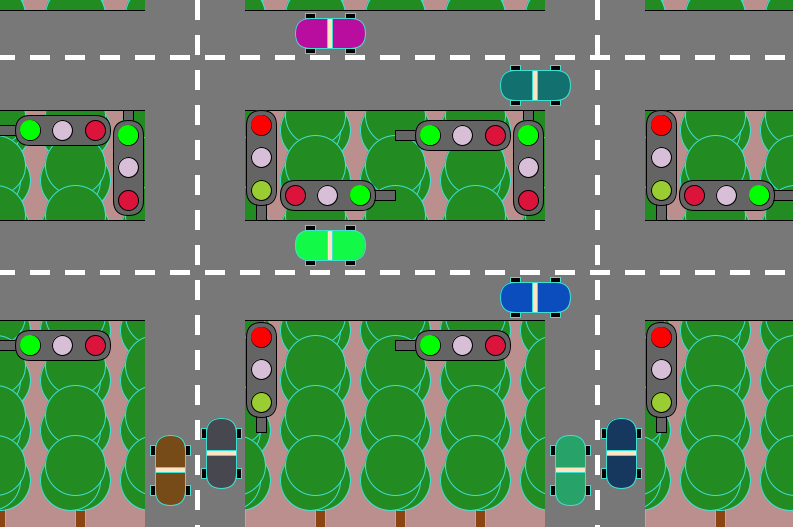

# TrafficLights-Simulation

A simple traffic lights simulation built using Processing. This project demonstrates the logic and behavior of traffic signals in a controlled environment, ideal for understanding timing, sequencing, and flow control in traffic systems.

go to: [CodeCrafters](https://marciofelicioo.github.io/CodeCrafters/) to check this project
